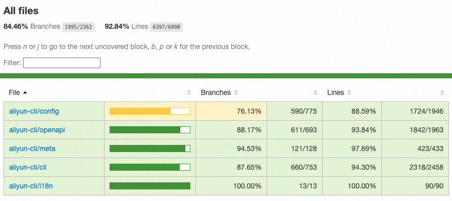

# gocov

A better test coverage reporter than `go tool cover`. The project inspired by Istanbul.

## Installation

```sh
npm install @jacksontian/gocov -g
```

## Usage

Run go test first:

```sh
go test -race -coverprofile=coverage.txt -covermode=atomic ...
```

The coverage data file will be generated at coverage.txt.

```sh
gocov coverage.txt
```

Open the `coverage/index.html`.

## Features

- Prettier HTML reporter.
- Sort by filename, branch coverage rate, line coverage rate.
- Group by dictionary.



## License
The BSD-3 License